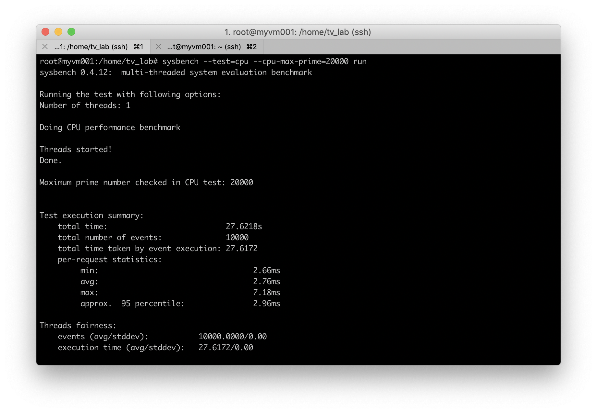
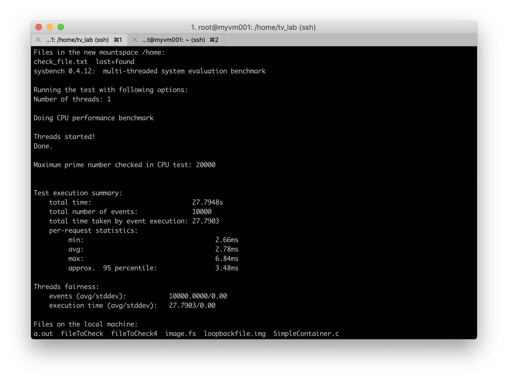
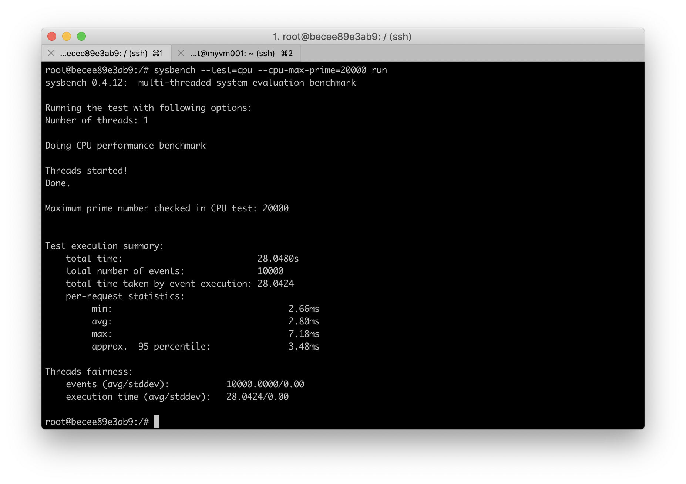

# Create Simple Container

Denis Rangulov

Total Virtualization

Innopolis University 2019

# Intro

The idea of the work is to create a process (own container), that is isolated, has its own namespaces, has its own root directory in file system, networking, can save its filesystem as file, and can even limit its own resources via CGroups. 

Then comparing the own container with LXC, Docker.

## How to run

*   Deploy own_container.c in some Linux OS on some machine (I used Ubuntu Linux 16.04 (64 bit) on [Microsoft Azure](https://cloud.mts.ru/) virtual machine)
*   Run commands:
    *   gcc own_container.c
    *   ./a.out
*   If you want to use CGroups to limit some resources, uncomment related lines in code and run commands before a program execution:
    *   sudo mkdir /sys/fs/cgroup/cpu/demo
    *   echo 50000 > /sys/fs/cgroup/cpu/demo/cpu.cfs_quota_us
    *   echo 100000 > /sys/fs/cgroup/cpu/demo/cpu.cfs_period_us

# Tests

<table>
  <tr>
   <td>Metric 
   </td>
   <td>Sysbench command
   </td>
   <td>Why this command
   </td>
   <td>What is interesting in sysbench output
   </td>
  </tr>
  <tr>
   <td>CPU total time [sec]
   </td>
   <td>sysbench --test=cpu --cpu-max-prime=20000 run
   </td>
   <td>I increase cpu-max-prime because i expect to see more noticable difference between total time in different containers. Considered to be a good example, found from the following ​ source<a href="https://www.howtoforge.com/how-to-benchmark-your-system-cpu-file-io-mysql-with-sysbench"> [SysBenchExample]</a>
   </td>
   <td>total time in secunds 
   </td>
  </tr>
  <tr>
   <td>File IO speed 

[Mb/sec]
   </td>
   <td>
<ul>

<li>sysbench --test=fileio --file-total-size=40G prepare

<li>sysbench --test=fileio --file-total-size=40G --file-test-mode=rndrw --init-rng=on --max-time=300 --max-requests=0 run

<li>sysbench --test=fileio --file-total-size=40G cleanup
</li>
</ul>
   </td>
   <td>File is 40 Gb size because otherwise, the system will use RAM for caching which tampers with the benchmark results
   </td>
   <td>Read,write speed
   </td>
  </tr>
</table>

# Table With Metrics

<table>
  <tr>
   <td>
   </td>
   <td>host machine
   </td>
   <td>my container
   </td>
   <td>LXC (Ubuntu 16 i386)
   </td>
   <td>Docker(Ubuntu 16)
   </td>
  </tr>
  <tr>
   <td>CPU  total time [sec]
   </td>
   <td>27.6218
   </td>
   <td>27.7948
   </td>
   <td>27.8297
   </td>
   <td>28.0480
   </td>
  </tr>
  <tr>
   <td>File IO speed

[Mb/sec]
   </td>
   <td>1.0885 
   </td>
   <td>1.1458
   </td>
   <td>1.1289
   </td>
   <td>1.1302
   </td>
  </tr>
</table>

# Some screens 
Host machine

## My container

## Docker(Ubuntu 16)

# Sources

1. [SysBenchExample] - "How to Benchmark Your System (CPU, File IO, MySQL) with Sysbench" \
[ https://www.howtoforge.com/how-to-benchmark-your-system-cpu-file-io-mysql-with-sysbench](https://www.howtoforge.com/how-to-benchmark-your-system-cpu-file-io-mysql-with-sysbench) 
